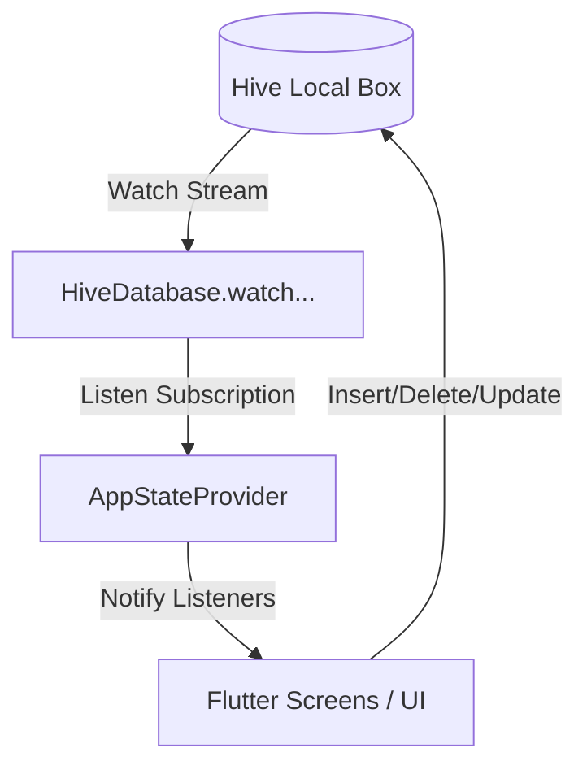

# รายงานการวิเคราะห์ระบบหลังบ้าน (Backend Database Analysis)

ไฟล์นี้ทำการสรุปและวิเคราะห์โครงสร้างฐานข้อมูลและระบบการจัดการข้อมูลเบื้องหลังของแอปพลิเคชัน **LosCheck** ในปัจจุบัน เพื่อให้เห็นภาพรวมของสถาปัตยกรรม (Architecture) จุดแข็ง และแนวทางการปรับปรุงในอนาคต

---

## 🏗️ 1. เทคโนโลยีหลังบ้านที่ใช้งาน (Technology Stack)

ในปัจจุบัน แอปพลิเคชัน LosCheck ใช้สถาปัตยกรรมแบบ **Local-First (Offline-First)** โดยมีระบบการจัดการข้อมูลภายในเครื่องทั้งหมด ดังนี้:

* **ฐานข้อมูลหลัก (Database):** ใช้ไลบรารี **[Hive](https://pub.dev/packages/hive_flutter)**
  * Hive เป็น NoSQL Key-Value Database สำหรับ Flutter ที่มีความเร็วสูงมาก เนื่องจากเขียนและอ่านข้อมูลผ่านรูปแบบ Binary โดยตรง
  * มีขนาดเบามาก และไม่ต้องใช้เอนจิน SQL ตัวเต็ม ทำให้ไม่กินทรัพยากรเครื่อง
* **การจัดการสถานะ (State Management):** ใช้ **[Provider](https://pub.dev/packages/provider)** ร่วมกับ **Streams**
  * คอยเชื่อมโยงข้อมูลจากกล่องบันทึกของ Hive และสตรีมสดผลลัพธ์ไปยังหน้า UI โดยตรงผ่านกระบวนการ Reactive Programming

---

## 🗄️ 2. โครงสร้างข้อมูล (Database Schema & Adaptors)

ข้อมูลในแอปพลิเคชันถูกจัดสรรออกเป็น 3 ตารางหลัก (เรียกว่า **Hive Box**) โดยแปลงจากคลาส Dart ผ่านกลไก **TypeAdapter** ดังนี้:

### 2.1 กล่องข้อมูลลูกค้า (`customers` Box)
* **รหัสประเภท (typeId):** `0`
* **โครงสร้างโมเดล (`CustomerRecord`):**
  * `phone` (String): เบอร์โทรศัพท์ลูกค้า (ใช้เป็นคีย์หลักในการสืบค้น/อัปเดต)
  * `name` (String): ชื่อลูกค้า
  * `address` (String): ที่อยู่จัดส่ง/บ้านเลขที่
  * `createdAt` (DateTime): วันที่เริ่มบันทึกข้อมูล
  * `imageUrl` (String?): เส้นทางรูปภาพบ้านลูกค้าที่เก็บไว้ในเครื่อง
  * `latitude` (double?): พิกัดละติจูด (รองรับระบบแผนที่นำทาง)
  * `longitude` (double?): พิกัดลองจิจูด (รองรับระบบแผนที่นำทาง)

### 2.2 กล่องข้อมูลรอบวิ่งรถ (`trips` Box)
* **รหัสประเภท (typeId):** `1`
* **โครงสร้างโมเดล (`TripRecord`):**
  * `distanceLabel` (String): ระยะทางในการเดินทาง เช่น "10 กม."
  * `rateBaht` (int): อัตราเงินค่าวิ่งรอบ (บาท)
  * `rounds` (int): จำนวนรอบที่วิ่งจริง
  * `createdAt` (DateTime): วันเวลาที่บันทึกข้อมูลทริป

### 2.3 กล่องประวัติการนำทางสำเร็จ (`route_completions` Box)
* **รหัสประเภท (typeId):** `2`
* **โครงสร้างโมเดล (`RouteCompletionRecord`):**
  * `points` (int): จำนวนลูกค้าหรือเป้าหมายที่ขับส่งของได้สำเร็จในรอบทริปนั้น
  * `distance` (double): ระยะทางรวมในการเดินทางสำเร็จ (กิโลเมตร)
  * `createdAt` (DateTime): วันเวลาที่สิ้นสุดทริป

---

## ⚡ 3. การทำงานร่วมกันและตรรกะแบบ Reactive (Data Flow)

กลไกการดึงข้อมูลและอัปเดตหน้าจอทำผ่าน `AppStateProvider` และฐานข้อมูลแบบเวลาจริง:

1. **การดึงข้อมูลสด (Live Watch):** ตัวแอปใช้ฟังก์ชัน `.watch()` ของ Hive (เช่น `watchAllCustomers()`) ซึ่งจะคอยส่งข้อมูลใหม่เข้า Stream ตลอดเวลาที่มีการเปลี่ยนแปลง
2. **การอัปเดตหน้าจออัตโนมัติ:** `AppStateProvider` จะทำหน้าที่ฟังข้อความ (Listen) จากสตรีมเหล่านั้น เมื่อคนขับแก้ไขข้อมูลลูกค้าหรือสร้างทริปใหม่ หน้าจอ UI จะรีเฟรชข้อมูลตัวเลขทันทีโดยไม่ต้องปิดแล้วเปิดใหม่

---

## 🌟 4. จุดแข็งของสถาปัตยกรรมปัจจุบัน (Key Strengths)

* **ความเสถียรแบบออฟไลน์ 100%:** คนส่งของสามารถบันทึกข้อมูล ถ่ายรูปบ้านจัดส่ง หรือตรวจสอบประวัติทริปได้แม้อยู่ในพื้นที่อับสัญญาณหรือไม่มีอินเทอร์เน็ต
* **ความเร็วในการประมวลผลสูง:** การเขียนและอ่านแบบ Binary Stream ของ Hive มีความเร็วเหนือกว่า SQFlite (SQLite) เฉลี่ยถึง 5-10 เท่า ส่งผลให้แอปเปิดหน้าจอลิสต์ลูกค้าหลายร้อยคนได้แบบไร้อาการหน่วง
* **การออกแบบเพื่อการทดสอบ (Testability):** มีระบบ In-Memory สำรองอัตโนมัติเมื่อรันในโหมดจำลอง (`isTesting`) ทำให้สามารถเขียน Widget Tests ตรวจจับบั๊กได้ง่ายและเร็วมาก
* **มีตัวจัดการเปลี่ยนย้ายข้อมูลดั้งเดิม (Data Migration):** รองรับการย้ายประวัติและสถิติการส่งของรอบวันเดิมที่เคยเก็บใน `SharedPreferences` มาอัปเกรดเข้าฐานข้อมูลกลางอย่างเป็นระเบียบเมื่อผู้ใช้งานอัปเดตแอป

---

## ⚠️ 5. ข้อจำกัดและข้อเสนอแนะในการพัฒนาในอนาคต (Recommendations)

### 🚨 ข้อจำกัดเรื่องการสำรองข้อมูล (Data Loss Risk)
* **สถานะปัจจุบัน:** ข้อมูลทั้งหมดจัดเก็บอยู่ในระดับ Local Disk ของมือถือเครื่องนั้น ๆ 100%
* **ความเสี่ยง:** หากผู้ใช้ทำมือถือหาย, แอปถูกล้างข้อมูล (Clear Data), หรือถอนการติดตั้งแอป ข้อมูลประวัติลูกค้าและเงินสะสมทั้งหมดจะสูญหายทันที
* **ข้อแนะนำ:** ควรเพิ่มฟังก์ชันการสำรองข้อมูล (Backup) ออกมาเป็นไฟล์ไฟล์เดียว (เช่น .json หรือ .zip) บันทึกเก็บไว้ในตัวเครื่อง หรือพัฒนาระบบซิงค์ข้อมูลขึ้นระบบคลาวด์ เช่น **Google Drive API** หรือเซิร์ฟเวอร์ฐานข้อมูลระยะไกล

### 📈 การรองรับจำนวนข้อมูลขนาดใหญ่ (Scalability)
* **สถานะปัจจุบัน:** การค้นหาลูกค้าใช้การดึงรายชื่อลูกค้าทั้งหมดมาไว้ในแรม แล้วฟิลเตอร์หาด้วยภาษา Dart (`.where()`)
* **ประเมินผล:** หากมีลูกค้าหลักร้อยถึงพันคน วิธีนี้จะเร็วมากเพราะทำในแรมโดยตรง แต่ถ้าสะสมไปหลายปีจนยอดลูกค้าแตะ 10,000+ ราย อาจเริ่มกินทรัพยากรแรมขึ้นชั่วขณะ
* **ข้อแนะนำ:** หากแอปมีผู้ใช้งานเพิ่มขึ้นอย่างก้าวกระโดด ควรปรับการกรองคำค้นหาให้ไปทำที่ระดับ Query Index ของ Database แทนการโหลดข้อมูลขึ้นมาหมดเครื่อง

### 🔄 การปรับโครงสร้างฟิลด์ข้อมูลในอนาคต (Schema Migration)
* **สถานะปัจจุบัน:** ตัวแปลง Hive TypeAdapter เขียนมือเพื่อให้รองรับการเพิ่มพิกัดแผนที่ (Latitude/Longitude) แบบปลอดภัยย้อนหลัง
* **ข้อแนะนำ:** ในอนาคตหากต้องการเพิ่มข้อมูลลูกค้า เช่น อีเมล หรือสถานะ VIP ควรระมัดระวังในการอัปเดตรุ่นของ TypeAdapter โดยตั้งค่า Default value เพื่อป้องกันการอ่านไฟล์ฐานข้อมูลเดิมแล้วระบบแครช
